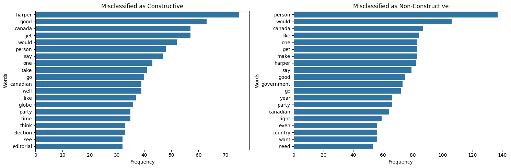
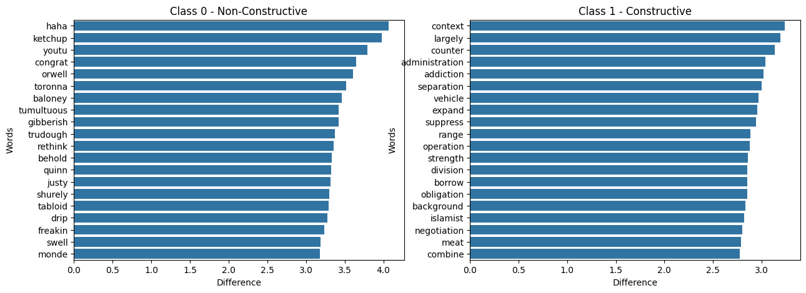
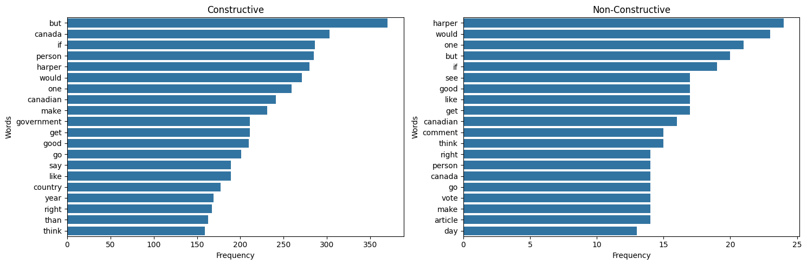
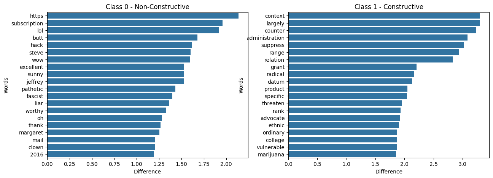

For these tests, we variated the use of stopwords and punctuation removal in the preprocessing step. So we used two different configurations for the preprocessing step. 

Test 1: Here we removed stopwords and punctuation.
Test 2: Here we kept stopwords and punctuation.

We also tried avoiding lemmatization in the preprocessing step, but the results were not good, so we decided to keep it.

## Naive Bayes

| Test      | Accurracy | Precision | Recall    | F1 Score |
|-----------|-----------|-----------|-----------| ---------|
| Test 1    | 68.68%    | 71.00%    | 67.00%    | 67.00%   |
| Test 2    | 68.68%    | 70.00%    | 67.00%    | 67.00%   |

Performance on both test is basically the same and they keep the same trends with both classes. Low `precision` (~66%) and high `recall` (~84%) for `class 1` (constructive) and high `precision` (~73%) and low `recall` (~50%) for `class 0` (non-constructive). Meaning that for class 0 it has many false positives, and for class 1 it has many false negatives.

### Test 1

#### Most common words

#### Weights per words per class

#### Missclassified words class 0
| Rank | Word     | Count Correctly Classified | Count Missclassified |
|------|----------|----------------------------|----------------------|
| 1.0  | harper   | 26.0                       | 76.0                 |
| 17.0 | good     | 13.0                       | 66.0                 |
| 20.0 | canada   | 12.0                       | 57.0                 |
| 4.0  | get      | 18.0                       | 56.0                 |
| 3.0  | would    | 20.0                       | 52.0                 |
| 21.0 | person   | 12.0                       | 49.0                 |
| 22.0 | say      | 12.0                       | 47.0                 |
| 2.0  | one      | 21.0                       | 43.0                 |
| 28.0 | take     | 10.0                       | 41.0                 |
| 6.0  | canadian | 16.0                       | 40.0                 |

### Missclassified words class 1

| Rank | Word       | Count Correctly Classified | Count Missclassified |
|------|------------|----------------------------|-----------------------|
| 3.0  | person     | 293.0                      | 120.0                 |
| 5.0  | would      | 266.0                      | 97.0                  |
| 1.0  | canada     | 314.0                      | 83.0                  |
| 8.0  | get        | 219.0                      | 83.0                  |
| 2.0  | harper     | 296.0                      | 82.0                  |
| 13.0 | like       | 190.0                      | 82.0                  |
| 7.0  | make       | 231.0                      | 81.0                  |
| 4.0  | one        | 266.0                      | 77.0                  |
| 11.0 | good       | 208.0                      | 73.0                  |
| 10.0 | government | 209.0                      | 69.0                  |

### Test 4

#### Most common words

#### Weights per words per class

##### Class 1 - constructive
- thank you for write this piece . the world of nutrition be be turn upside down with the emergence of research show that the low - fat high - carb dietary advice we have be give by government and other authority over the past few decade have not only be wrong and harmful but be base on flimsy and contrived study while contrary finding be `suppress` . why be leslie beck and andre picard mia when it come to report this major story ?
- "recognize demographic reality be not divisive in itself . pretend they be not there except when you want to use they to imply one group be more worthy than the other be what be divisive , and that be what trudeau do by jump on what , in `context` , be mean as the reverse . glad to see he be get a taste of his own medicine now , be criticize for his remark about violence against woman . how do it feel , jt ?"

#### Missclassified words class 0
| Rank | Word     | Count Correctly Classified (0) | Count Missclassified |
|------|----------|----------------------------|----------------------|
| 1.0  | harper   | 26.0                       | 76.0                 |
| 2.0  | but      | 21.0                       | 69.0                 |
| 10.0 | good     | 15.0                       | 66.0                 |
| 5.0  | if       | 19.0                       | 57.0                 |
| 22.0 | canada   | 12.0                       | 57.0                 |
| 6.0  | get      | 18.0                       | 56.0                 |
| 4.0  | would    | 21.0                       | 53.0                 |
| 23.0 | person   | 12.0                       | 49.0                 |
| 24.0 | say      | 12.0                       | 47.0                 |
| 3.0  | one      | 21.0                       | 43.0                 |

- "stephen `harper` may be toast , `but` circumstance be only part of it . the problem be , to actually like or admire the public persona of the man , you have to really work at it . he do not make it easy to make allowance for he when thing go wrong . also , have be brand as the ' haper government ' , everything be clearly his fault or his glory . he want it that way ."
- "i myself be a immigrant to this county and i owe it to `canada` for where i be now . canadia be the `good` country in the world to live in . instead of blam political party , we must all strive to make this country `good` than what it be yesterday . even with the volunteering at various organization i do not think i can ever fully repay `canada` ."
- this be simply a reflection government 's intellectual challenge in governance and its contempt for democracy and accountability .

### Missclassified words class 1

| Rank | Word     | Count Correctly Classified (1) | Count Missclassified |
|------|----------|----------------------------|----------------------|
| 1.0  | but      | 372.0                      | 128.0                |
| 5.0  | person   | 292.0                      | 120.0                |
| 3.0  | if       | 309.0                      | 108.0                |
| 6.0  | would    | 278.0                      | 100.0                |
| 10.0 | get      | 219.0                      | 83.0                 |
| 2.0  | canada   | 314.0                      | 83.0                 |
| 9.0  | make     | 232.0                      | 82.0                 |
| 15.0 | like     | 190.0                      | 82.0                 |
| 4.0  | harper   | 296.0                      | 82.0                 |
| 11.0 | good     | 216.0                      | 78.0                 |

- anyone `but` `harper` in 2015 .
- take obama ... look how all that hopey changey stuff work for he !! yes the voter `get` change ... `but` not in a `good` way . the big lame duck president in history .
- i have always think that `harper` be two - face . trouble be a lot of `person` who support israel do not think about what he be do to this country . `harper` be not good for `canada` and i be not sure he be good for israel .

## Neural Network

| Test      | Accurracy | Precision | Recall    | F1 Score |
|-----------|-----------|-----------|-----------| ---------|
| Test 1    | 85.20%    | 85.59%    | 86.99%    | 86.29%   |
| Test 2    | 85.65%    | 85.99%    | 87.47%    | 86.72%   |

### Misclassifications

Here we present some examples of misclassifications for the neural network. We present the class that the comment was classified, also we classify some of the comments as `Actual missclassification` so the comment was classified as class 0 but it should be class 1 and vice versa. But also we classify others as `Probably wrong label on the dataset` so the preddiction was actually accurate taking into account the nature of the comment, so the error is in its label on the training data.

#### Classified as class 0 (non-constructive comments)

##### Actual missclassification (should be 1 constructive)
- Canada spends @10B per year on Indian Affairs. Rath wants a 100B for the natives - or 10 years of our spending. There are @1M natives in the country. Offer 1M per living native. Run a plebisite that would, in exchange for the amount above:-extenguish any and all treaty rights for any bands that vote in majority to accept Canada's offer to pay for the past. -all reserves will be converted to municipalities-all residents of the reserves will receive title to the property on which they reside-the remianing land divided on pro rata basis between-if 2/3rds majority accept the offer in the national vote - ALL natives, ALL bands will be includedThen we can all get on with it. Natives can continue to hold onto their culture they way any other cultural community does. Yet they will be able to be a part of society without being apart.
- This is an issue that 99 % of Canadians dont understand or give the slightest care about . The CPC is just loving this , watching Justin make himself appear more aloof , even in comparison to Harper ( whos pretty aloof ) . Just plays into the who cares about your priorities line . If the NDP and LPC were smart , theyd shuffle off this issue and on to more important matters , in the eyes of the general population .

#### Probably wrong label on the dataset (should be labeled as 0 non-constructive)

- Stop wasting $$$$$$ on Climate Change and start adding $$$$ to infastructure... Climate has been changing since the beginning of time and will continue to do so.....As for our sewers they were installed for the 25 year storm or 50 year storm, time to upgrade (long over due)...Don't grease Unions pockets, and the list goes on.........Ex Mayor Miller was part of the problem, and the list goes on.........
- I'm as smart as someone like David Suzuki so can someone please tell me what this will all mean if we actually do reduce CO2 emissions? When will the weather start returning to normal (with no storms or natural disasters) and the earth start cooling to the point that everything will be okay? When and how will we know?

#### Classified as class 1 (constructive comments)

#### Actual missclassification (should be 0 non-constructive)
- Where is our federal government 
- Every time oil prices go up, Alberta's politicians breath a sigh of relief and say 'this time it will be different'.It never is . . .
- It is beyond my comprehension having little pierre or angry tom at the helm during a real emergency. Almost laughable.

#### Probably wrong label on the dataset (should be labeled as 1 constructive)
- An unfortunate situation for many in Vancouver, but a great opportunity for Calgary. Falling house prices, acres of cheap, high-quality office space. Maybe it is possible to diversify the economy!
